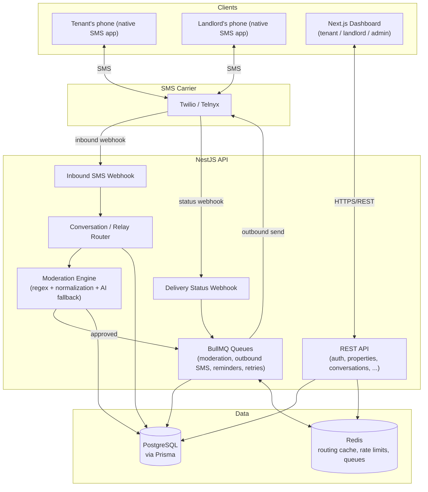
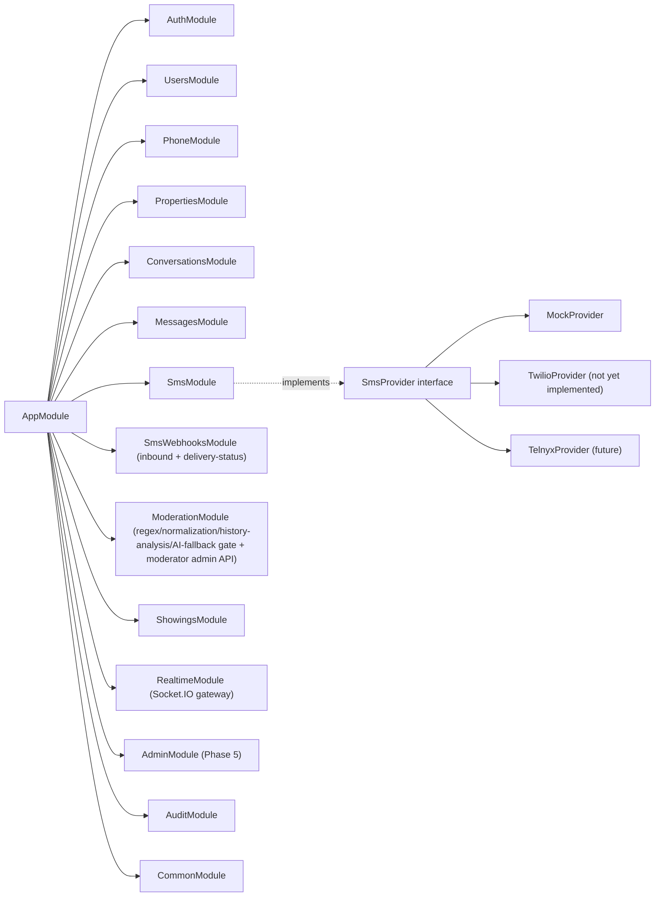
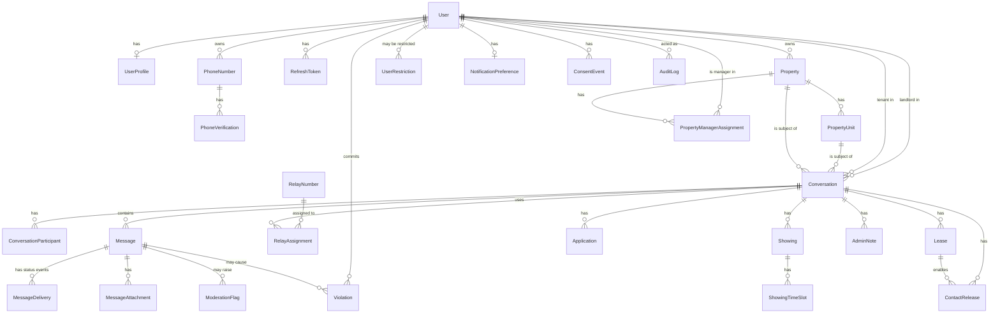

# Architecture

## System overview



## Module boundaries (NestJS)

Each domain is an independent Nest module with its own controller/service/DTOs. Cross-cutting
concerns (auth, RBAC, audit logging, phone encryption) live in `common/`, `audit/`, and are
registered as global providers so every module gets them without explicit imports.



## SMS provider abstraction

```typescript
interface SmsProvider {
  sendMessage(input: SendSmsInput): Promise<SendSmsResult>;
  validateWebhook(input: ValidateWebhookInput): boolean;
  parseInboundMessage(input: unknown): ParsedInboundMessage;
  parseDeliveryStatus(input: unknown): ParsedDeliveryStatus;
}
```

`SmsModule` binds a single DI token (`SMS_PROVIDER`) to whichever concrete implementation is
selected by the `SMS_PROVIDER` env var. Nothing else in the codebase imports Twilio or Telnyx
directly — conversation routing, delivery tracking, and moderation only ever talk to the
interface. `MockSmsProvider` (Phase 1) implements it entirely in memory for local dev/tests;
`TwilioProvider`/`TelnyxProvider` land in Phase 2 without touching any caller.

## Phone-number privacy model

1. Real phone numbers are only ever written to `PhoneNumber.encryptedNumber`, an AES-256-GCM
   ciphertext keyed by `PHONE_ENCRYPTION_KEY` (32-byte key, env-provided, never in source).
2. `PhoneNumber.numberHash` is an HMAC-SHA256 (keyed by a *separate* `PHONE_HASH_SECRET`) used
   purely for equality lookups — it cannot be reversed to the original number, and a leak of the
   hash key alone does not compromise the encryption key.
3. Every response DTO (`UserResponseDto`, `PhoneNumberResponseDto`, `PropertyResponseDto`, ...) is
   an explicit allow-list class with a `static from(...)` constructor — there is no code path that
   serializes a raw Prisma row, so a schema change can't accidentally leak a new sensitive field.
4. Dashboards only ever receive a masked number (`(***) ***-1234`) computed server-side from
   `last4`; the full number is decrypted only inside the SMS-send code path.
5. Landlord and tenant SMS traffic is relayed entirely through pooled `RelayNumber`s (see
   `ConversationsService.assignRelayNumber` and `SmsRoutingService`) — neither party's device
   ever sees the other's number in their native messaging app, and the real recipient number is
   only ever decrypted inside `MessagesService` at the moment of the provider `sendMessage` call.
6. Beyond the phone number itself, the tenant's *identity* stays anonymized to the landlord
   during the inquiry stage: `ConversationResponseDto.tenantDisplayName` and every
   `MessageResponseDto.senderDisplayName` for a tenant-authored message render as `Tenant #1234`
   (a deterministic, non-reversible HMAC-derived label — see
   `common/utils/anonymized-label.util.ts`), never the tenant's real profile name, matching the
   same label used in the SMS notification text.

## Database relationship diagram


